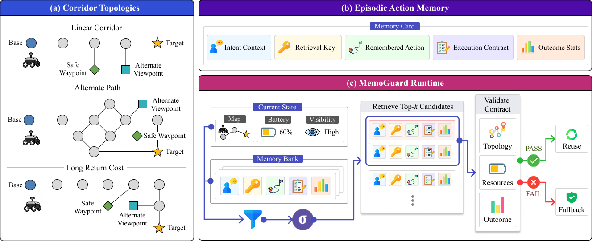

# MemoGuard: An Adaptive Runtime for Guarding Against Memory Traps in Communication-Limited Robot Navigation

<p align="center">
	
	<br>
	<b>Safe and efficient episodic memory reuse for communication-limited robots</b>
</p>

<p align="center">
<a href="https://www.python.org/downloads/"></a>
<a href="https://arxiv.org/abs/0000.00000"></a>
<a href="LICENSE"></a>
</p>



## Contents

- [News](#news)
- [Overview](#overview)
- [Project Highlights](#project-highlights)
- [Project Structure](#project-structure)
- [Quick Start](#quick-start)
- [Running MemoGuard](#running-memoguard)
- [Results](#results)

## News

- **[2026/07]** MemoGuard is accepted to ESWEEK 2026 (CODES LBR) and will appear in IEEE Embedded Systems Letters (ESL).

## Overview

Episodic memory reuse helps communication-limited robots make efficient onboard decisions, but a highly similar memory may be unsafe under changed topology, battery, or outcome conditions. We call these execution-invalid memories **memory traps**.

MemoGuard validates retrieved memories against topology, resource, and outcome contracts before reuse, invoking local fallback reasoning only when validation fails. This repository provides the simulator, memory pipeline, trap scenarios, policies, and experiment scripts used to evaluate MemoGuard.

## Project Highlights

- **Memory-trap-aware reuse:** Detects high-similarity memories that are no longer valid to execute.
- **Contract-based validation:** Guards memory reuse using topology, resource-trajectory, and outcome-reliability checks.
- **Adaptive fallback reasoning:** Invokes local reasoning only when retrieval fails or a candidate violates a contract.
- **Safety-efficiency evaluation:** Compares MemoGuard with similarity-only reuse, threshold reuse, and always-reasoning policies.
- **Reproducible simulation pipeline:** Includes corridor maps, episodic memories, clean scenarios, trap scenarios, and parallel batch execution.

## Project Structure

```text
memo_guard/
├── configs/                 # Simulator, scenario, and trap-generation settings
├── data/
│   ├── maps/                # Graph-based corridor map templates
│   ├── memories/            # Extracted episodic memories
│   ├── scenarios/           # Generated clean scenarios
│   ├── filtered_scenarios/  # Scenarios selected for experiments
│   └── trap_scenarios/      # Memory-trap evaluation scenarios
├── memory/                  # Memory extraction, representation, and retrieval
├── policies/                # MemoGuard and baseline decision policies
├── scenario/                # Scenario and memory-trap generation logic
├── scripts/                 # Simulation, batch execution, and utility CLIs
└── simulator/               # Robot state, planner, environment, and metrics
```

The main MemoGuard policy is implemented in `policies/memo_guard.py`. Single-scenario and batch experiments are launched through `scripts/run_simulation.py` and `scripts/run_batch_simulations.py`, respectively.

## Quick Start

Clone the repository:

```bash
git clone https://github.com/hetheiin/memoguard.git
cd memoguard
```

### Using uv (Recommended)

Create a Python 3.11 environment and install the dependencies with [uv](https://docs.astral.sh/uv/):

```bash
uv venv --python 3.11
uv pip install -r requirements.txt
```

### Using pip

Create and activate a Python 3.11 virtual environment, then install the dependencies:

```bash
python -m venv .venv
source .venv/bin/activate
pip install -r requirements.txt
```

## Running MemoGuard

### Run a Single Scenario

Run MemoGuard on one provided memory-trap scenario:

```bash
python scripts/run_simulation.py \
    data/trap_scenarios/clean_linear_corridor_0/reduce_battery/scenario_10.json \
    --policy memo_guard \
    --memory-path data/memories/memories.json \
```

Run the same scenario with a comparison policy by changing `--policy`.

Available evaluation policies include:

- `memo_guard`: validate retrieved memories and reason only when validation fails
- `top1_reuse`: execute the highest-ranked retrieved memory directly
- `threshold_reuse`: reuse a memory above the similarity threshold; otherwise reason
- `topk_count_reuse`: select a frequently observed memory from the top-k results
- `always_reasoning`: invoke fallback reasoning at every decision step
- `oracle`: use privileged simulator information as an upper-bound policy

### Run Batch Experiments

Run MemoGuard over all provided trap scenarios with repeated trials:

```bash
python scripts/run_batch_simulations.py \
    data/trap_scenarios \
    --policy memo_guard \
    --memory-path data/memories/memories.json \
    --trials 100 \
    --max-workers 10 \
```

## Results

MemoGuard achieves the best average mission success while substantially reducing safety violations compared with similarity-only memory reuse. It also preserves the safety level of always reasoning with fewer fallback calls.

| Policy | Mission Success (%) ↑ | Target Inspected (%) ↑ | Battery Depletion (%) ↓ | Safety Violation (%) ↓ | Fallback Calls ↓ | Execution Cost ↓ |
| --- | ---: | ---: | ---: | ---: | ---: | ---: |
| Top-1 Reuse | 32.6 | 80.4 | 18.9 | 67.4 | **0.00** | **36.73** |
| Threshold Reuse | 32.7 | 76.6 | 18.9 | 67.1 | 0.53 | 37.09 |
| Always Reasoning | 83.5 | **98.6** | 2.2 | 16.5 | 18.58 | 63.03 |
| **MemoGuard** | **84.2** | 98.2 | **2.0** | **15.8** | 14.60 | 60.21 |

Across all trap scenarios, MemoGuard:

- reduces battery safety violations by **76.6%** compared with Top-1 Reuse.
- reduces fallback calls by **21.4%** compared with Always Reasoning.
- avoids **3.67 s** and **36.97 J** of local fallback-reasoning overhead per trial on an NVIDIA Jetson AGX Xavier.

See [Extended Results](results.md) for breakdowns by topology family and memory-trap type.

## Citation

If you find MemoGuard useful in your research, please cite:

```bibtex
@article{memoguard2026,
  title   = {MemoGuard: An Adaptive Runtime for Guarding Against Memory Traps in Communication-Limited Robot Navigation},
  author  = {Author Name},
  journal = {IEEE Embedded Systems Letters},
  year    = {2026}
}
```

## License

This project is licensed under the [MIT License](LICENSE).
